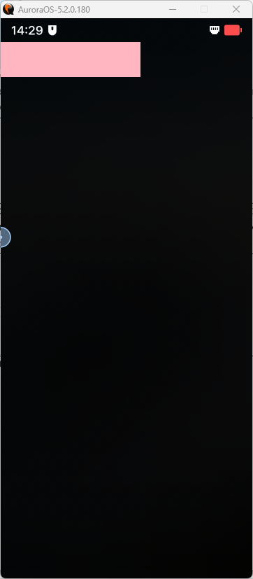
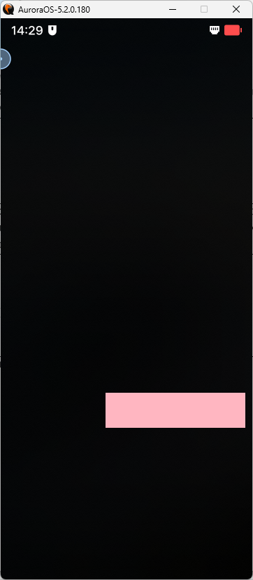
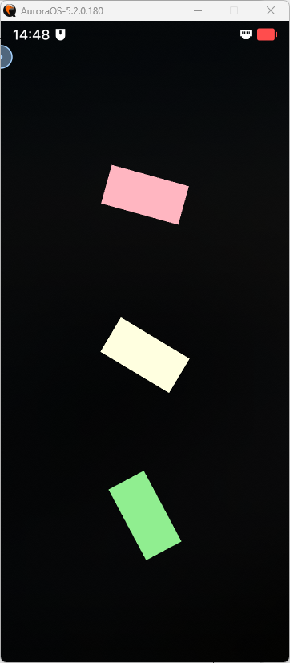
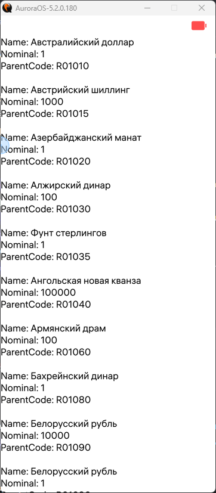

<div align="center">

# Отчёт

</div>

<div align="center">

## Практическая работа №15. Модуль 2

</div>

**Выполнил:** Федоров Артём Александрович <br>
**Курс:** 2<br>
**Группа:** ИНС-б-о-24-2<br>
**Направление:** 09.03.02 Информационные системы и технологии<br>
**Проверил:** Потапов Иван Романович

---

### Цель работы
Изучить и применить на практике основы разработки мобильных приложений для ОС «Аврора» в среде Aurora IDE с использованием Qt Quick и QML: освоить компоновку интерфейса (якоря, контейнеры), обработку событий, анимацию и состояния, навигацию (pageStack, Loader), работу с меню (PullDownMenu), а также реализовать загрузку внешних данных (XML, JSON), воспроизведение мультимедиа (аудио/видео) и взаимодействие с локальной БД (LocalStorage), создав собственные примеры приложений с комментариями к коду.

### Ход работы
#### Задание 1.
**Создать прямоугольник, чтобы при нажатии на него он передвигался в нижнюю часть экрана.**
1. Создан простой проект по шаблону в Aurora IDE.
2. Во вкладке Проекты --> Запуск подключён Qt QmLilve, чтобы проект не нужно было каждый раз пересобирать при внесении изменений.
3. После изменения "Отладка" на "Выпуск" проект был запущен. При внесении изменений используются горячие клавишы `ctr`+`s` для их сохранения. Изменения сразу отображаются в эмуляторе.
4. Было удалено `PageHeader` в `Mainpage.qml`: осталось:
```qml
import QtQuick 2.0
import Sailfish.Silica 1.0

Page {
    objectName: "mainPage"
    allowedOrientations: Orientation.All
}
```
5. Создан элемент прямоугольник `Rectangle` с заданным ему `id`, `width`, `height` и `color`.
```qml
Rectangle {
        id: rect
        width: 400
        height: 100
        color: "lightpink"
}
```
6. Создан эелемент `MouseArea` в прямоугольнике. Заданы `id`, `anchors.fill` и прописаны условия `onClicked`.
```qml
MouseArea {
    id: mouseArea
    anchors.fill: parent
    onClicked: rect.state === 'clicked' ? rect.state = "": rect.state = 'clicked';
}
```
7. Чтобы сработало нажатие, прописано состояние `State`. В нём добавлены имя состояния и изменения свойств. Свойства меняются у прямоугольника по координатам x и y.
```qml
states: [
            State {
                name: "clicked"
                PropertyChanges { target: rect; x: 300; y: 1000}
            }
        ]
```
8. Изменения сохранены, проект запущен. При нажатии на прямоугольник он перемещается вниз.<br>
<br>

9. Полный код:
```qml
import QtQuick 2.0
import Sailfish.Silica 1.0

Page {
    objectName: "mainPage"
    allowedOrientations: Orientation.All

    Rectangle {
        id: rect
        width: 400
        height: 100
        color: "lightpink"
    
        MouseArea {
            id: mouseArea
            anchors.fill: parent
            onClicked: rect.state === 'clicked' ? rect.state = "": rect.state = 'clicked';
        }

        states: [
            State {
                name: "clicked"
                PropertyChanges { target: rect; x: 300; y: 1000}
            }
        ]
    }
}
```

#### Задание 2.
**Создать три прямоугольника и применить к ним анимацию вращения без остановок, а также задать углы вращения от 0 до 90, 180 и 360 соответственно.**
1. Создан простой проект по шаблону в Aurora IDE.
2. Во вкладке Проекты --> Запуск подключён Qt QmLilve, чтобы проект не нужно было каждый раз пересобирать при внесении изменений.
3. После изменения "Отладка" на "Выпуск" проект был запущен. При внесении изменений используются горячие клавишы `ctr`+`s` для их сохранения. Изменения сразу отображаются в эмуляторе.
4. Было удалено `PageHeader` в `Mainpage.qml`: осталось:
```qml
import QtQuick 2.0
import Sailfish.Silica 1.0

Page {
    objectName: "mainPage"
    allowedOrientations: Orientation.All
}
```
5. Созданы три прямоугольника `Rectangle`, которые расположены в Column.
```qml
Column {
    anchors.centerIn: parent
    spacing: 300

    Rectangle{
        id: rect1
        width: 200
        height: 100
        color: "lightpink"
    }

    Rectangle{
        id: rect1
        width: 200
        height: 100
        color: "lightyellow"
    }

    Rectangle{
        id: rect1
        width: 200
        height: 100
        color: "lightgreen"
    }
}
```
6. К каждому прямоугольнику добавлена анимация вращения с `RotationAnimation` с соответственными значениями.
```qml
RotationAnimation on rotation {
    loops: Animation.Infinite
    from: 0
    to: 360
}
```
7. Полный код:
```
import QtQuick 2.0
import Sailfish.Silica 1.0

Page {
    objectName: "mainPage"
    allowedOrientations: Orientation.All

    Column {
        anchors.centerIn: parent
        spacing: 300

        Rectangle{
            id: rect1
            width: 200
            height: 100
            color: "lightpink"

            RotationAnimation on rotation {
                loops: Animation.Infinite
                from: 0
                to: 90
            }
        }

        Rectangle {
            id: rect2
            width: 200
            height: 100
            color: "lightyellow"

            RotationAnimation on rotation {
                loops: Animation.Infinite
                from: 0
                to: 180
            }
        }

        Rectangle {
            id: rect3
            width: 200
            height: 100
            color: "lightgreen"

            RotationAnimation on rotation {
                loops: Animation.Infinite
                from: 0
                to: 360
            }
        }
    }
}
```
8. Результат:<br>


#### Задание 3.
**Получить и отобразить Name, Nominal и ParentCode в виде списка из ресурса ЦБ РФ по адресу: [https](https://cbr.ru/scripts/XML_val.asp?d=0)**
1. Создан простой проект по шаблону в Aurora IDE.
2. Во вкладке Проекты --> Запуск подключён Qt QmLilve, чтобы проект не нужно было каждый раз пересобирать при внесении изменений.
3. После изменения "Отладка" на "Выпуск" проект был запущен. При внесении изменений используются горячие клавишы `ctr`+`s` для их сохранения. Изменения сразу отображаются в эмуляторе.
4. Так как для решения этой задачи будет использовано `XmlListModel`, в .pro файл добавлено: `QT += xmlpatterns`.
5. Было удалено `PageHeader` в `Mainpage.qml` и добавлен импорт `QtQuick.XmlListModel 2.0`:
```qml
import QtQuick 2.0
import Sailfish.Silica 1.0
improt QtQuick.XmlListModel 2.0

Page {
    objectName: "mainPage"
    allowedOrientations: Orientation.All
}
```
6. Создана XmlListModel с ролями XmlRole. Так как загрузить данные через интернет не удалось, было решено скачать xml файл и читать его из папки `pages`.
```
XmlListModel {
    id: model
    source: "cbr_data.xml"
    query: "/Valuta/Item"
    XmlRole { name: "name"; query: "Name/string()" }
    XmlRole { name: "nominal"; query: "Nominal/string()" }
    XmlRole { name: "parentCode"; query: "ParentCode/string()" }
}
```
7. Добавлено `onStatusChanged` в `XmlListModel` для вывода в консоль сообщения при получении данных об ошибке.
```qml
onStatusChanged: {
    if (status === XmlListModel.Ready) {
        console.log("Got", count, "Market Lib");
    } else if (status === XmlListModel.Error) {
        console.error("Error loading Market Libs:", errorString());
    }
}
```
8. Для отображения элементов прописан `ListView`.
```qml
ListView {
    anchors.fill: parent
    model: model
    spacing: 100
    delegate: Item {
        width: parent.width
        height: 60
        Column {
            Text { text: "Name: " + name }
            Text { text: "Nominal: " + nominal }
            Text { text: "ParentCode: " + parentCode }
        }
    }
}
```
9. Итоговый код:
```qml
import QtQuick 2.0
import Sailfish.Silica 1.0
import QtQuick.XmlListModel 2.0

Page {
    objectName: "mainPage"
    allowedOrientations: Orientation.All
    backgroundColor: "white"

    XmlListModel {
        id: model
        source: "cbr_data.xml"
        query: "/Valuta/Item"
        XmlRole { name: "name"; query: "Name/string()" }
        XmlRole { name: "nominal"; query: "Nominal/string()" }
        XmlRole { name: "parentCode"; query: "ParentCode/string()" }

        onStatusChanged: {
            if (status === XmlListModel.Ready) {
                console.log("Got", count, "Market Lib");
            } else if (status === XmlListModel.Error) {
                console.error("Error loading Market Libs:", errorString());
            }
        }
    }

    ListView {
        anchors.fill: parent
        model: model
        spacing: 100
        delegate: Item {
            width: parent.width
            height: 60
            Column {
                Text { text: "Name: " + name }
                Text { text: "Nominal: " + nominal }
                Text { text: "ParentCode: " + parentCode }
            }
        }
    }
}
```
10. Результат:<br>


### Вывод
В ходе лабораторной работы были изучены и применены на практике основы разработки мобильных приложений для ОС «Аврора» в среде Aurora IDE с использованием Qt Quick и QML: освоены компоновка интерфейса (якоря, контейнеры), обработка событий, анимация и состояния, навигация (pageStack, Loader), работа с меню (PullDownMenu), а также реализованы загрузка внешних данных (XML, JSON), воспроизведение мультимедиа (аудио/видео) и взаимодействие с локальной БД (LocalStorage). Все задания выполнены, разработаны собственные примеры приложений, программный код снабжён комментариями.
